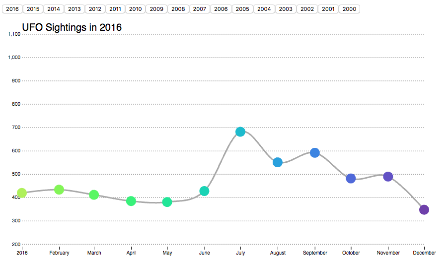

# Codeher Conference D3 Workshop

This repo holds resources from an introductory talk on D3, given by Mollie Pettit, originally at Code(Her) Conference 2017.

Connect with Mollie: [twitter](https://twitter.com/MollzMP) // mollie dot marie at gmail dot com // [linkedin](https://www.linkedin.com/in/molliempettit/)

## Upcoming Online D3.js Course
Interested in learning more!? Metis will be offering an online Data Visualization using D3.js course starting November 6th, 2017. Read more about the course [here](online_course.md).

## Slides

PDF to be posted here (link to be added after workshop).

## Demo

Finished example will be located here (link to be added after workshop). Data used in the demo (as well as some code I used to clean and prepare it) is included in the [data directory](/data).

## What we'll create:
Here is a photo of what our end result could look like. Once the workshop is over, I will provide the working, interactive example for you to play around with.

## Further Learnings / Fancy Examples
Further learnings and fancy examples located [here](d3examples.md).

## Helpful links used during workshop
 * [Margin Conventions](https://bl.ocks.org/mbostock/3019563)
 * [Data Joins](https://bost.ocks.org/mike/join/)
 * [Chaining Syntax](http://alignedleft.com/tutorials/d3/chaining-methods)
 * [How Selections Work](https://bost.ocks.org/mike/selection/)
 * [D3 Scales](https://github.com/d3/d3/blob/master/API.md#scales-d3-scale)
 * [D3 Axes](https://github.com/d3/d3-axis)
 * [Scatterplot example](https://bl.ocks.org/mbostock/3887118)
 * [D3 Path](https://github.com/d3/d3-path)
 * More on [D3 Path](https://www.dashingd3js.com/svg-paths-and-d3js)

## Get Started on your own Local Server
During the workshop we used jsbin.com to make this plot and share the code with you all in real time. When you're doing this on your own, however, you'll want to start up your own local server. [Here](local_server.md) is a quick run-through on how to get a local server set up.
